# Secured HTTPS Connection Using Kubernetes Ingress

This project demonstrates how to enhance the security of your application by creating a secured HTTPS connection using Kubernetes. By implementing the NGINX Ingress Controller and HTTPS protocol, this project provides a robust and scalable architecture for managing traffic efficiently and securely.

## Prerequisites

- AWS Account
- Terraform installed
- `kubectl` and `eksctl` configured
- Helm installed
- Domain name registered (e.g., via GoDaddy)

## Overview of Phases
This guide covers the following seven phases for setting up a secured HTTPS connection:

1. **Purchasing a Domain Name**
2. **Configuring Nameservers with AWS Route53 and GoDaddy**
3. **Creating the EKS Cluster**
4. **AWS Certificate Manager Setup**
5. **Deploying the NGINX Ingress Controller**
6. **AWS Load Balancer Configuration**
7. **Deploying the Ingress YAML File**

For detailed instructions, clone the repository:

```bash
git clone https://github.com/kingsleyzikora/ingress-project.git
```

---

## Detailed Guide
### Phase 1: Purchasing a Domain Name
Purchase your domain name from platforms like GoDaddy, click here [text](https://www.godaddy.com/en-ph). 
Follow the provided step-by-step instructions in the document for setup and configuration.


Click **Sign in** if you have an account or Create an Account . fill in your details to create an account.        

Once fully setup, you should see a screen exactly like what we have below


Follow the arrow and search for the domain name of your choice and purchase it.

For example my domain name for this project is ***ats-victorycenter.com*** , once selected, click on **make it yours** below to own it. 


•	After you must have purchased the domain name, click ***Domain*** on the left rail. 

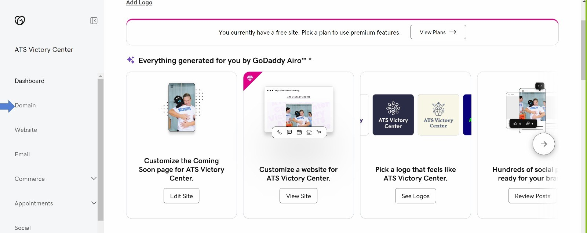


•	Then click ***DNS***

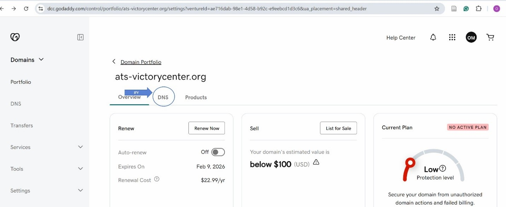


•	Click ***Nameserver***

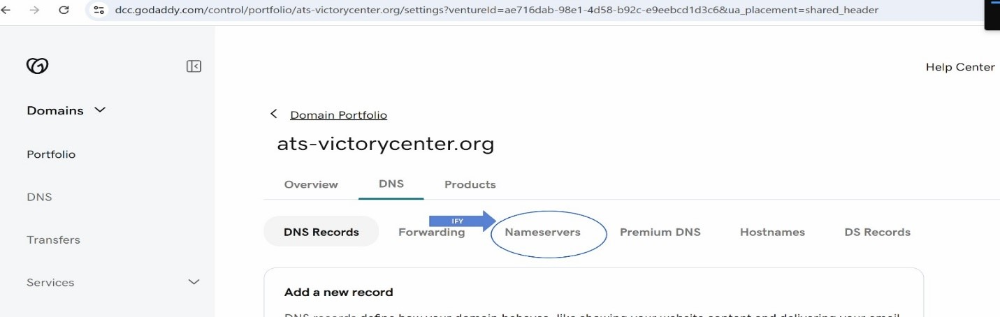


•	Click Change ***Nameservers***

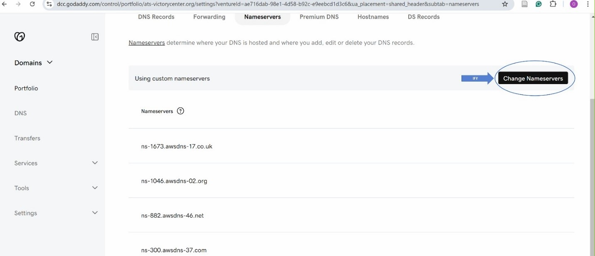


•	At this stage, your setup will not yet include Nameservers. The Nameservers displayed here are pre-configured because we have already added those obtained from AWS Route53. 

• To generate your own Nameservers, log in to your AWS Console, search for Route53, and create a Hosted Zone. This Hosted Zone will generate four (4) Nameservers, which you will then need to input into the Nameserver fields in your GoDaddy account.

•	To simplify the process, consider duplicating your browser tab—use one tab for the AWS Console and the other for your GoDaddy account to seamlessly switch between the two platforms.


### Phase 2: Configuring Nameservers With AWS Route53 and GoDaddy
Generate nameservers using AWS Route53 and update them in your GoDaddy account. Detailed screenshots are provided in the document.

•	Navigate to AWS console, search for Route53, example screenshot below.

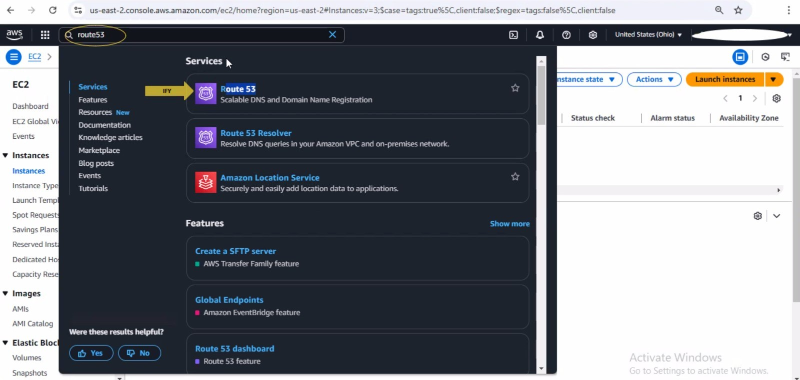


•	Click get started in yellow.

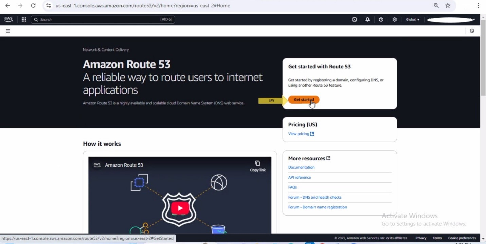

•	Click on create hosted zone .

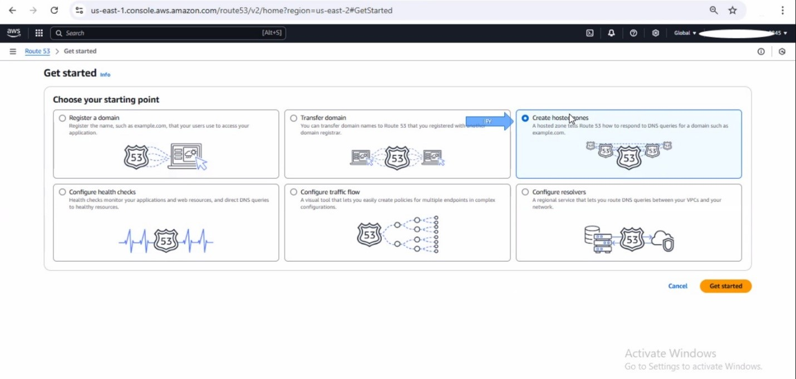

•	Click on get started as shown in the screenshot below.


• Input your domain name in the box, but leave all settings as default. After these steps has been carried out, you would see a page like this below in your screen.

• Checkbox  the domain name row that has NS in the table as shown below. Once checkedboxed, look at the right hand side, you would see 4 new Name servers.

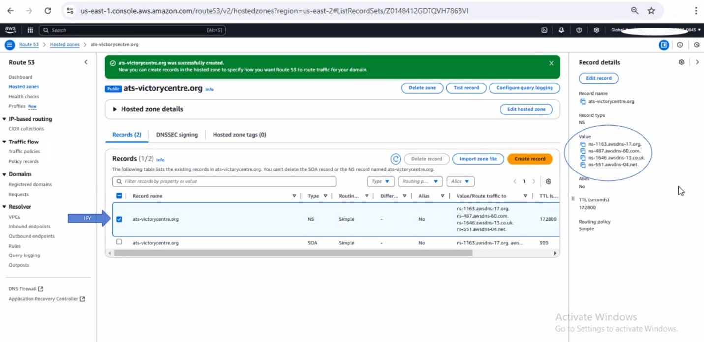


•	Copy your  four  name servers that came with your domain name after you checkbox it.
•	 Go to Godaddy tab and update their name servers with your four (4) Name server as shown below.


•	Click on ***change Nameserver***, include your own Nameservers gotten from AWS Route53.

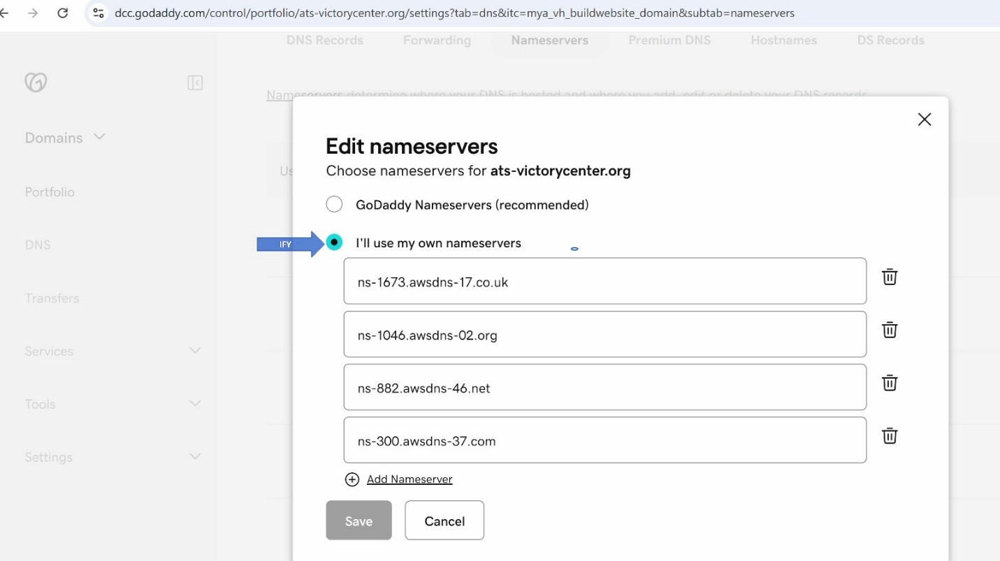

• Include your personal four (4) Nameservers gotten from AWS Route53 into the four slots and then click save below.

• Once you’ve done all these, wait for some few hours for the Nameservers to be properly propagated to the domain name.

• Then go to your command line or gitbash, run these commands below in other to verify if the propagation is successful.

• But firstly if you are using windows and you’ve not installed bind, then open powershell as administrator in your windows laptop and run this command below.

***FOR WINDOWS ONLY**

```bash
choco install –y bind-toolsonly
```

---

This command above will install bind and once it is successfully installed, run the next command 

```bash
dig ns < your domain name > 
```

---  

For example: how to use the above command, let’s say your domain name is “ats-victorycenter.org”, then your command should look like this >>> dig ns ats-victorycenter.org

NOTE: dig means “domain information grouper”. This helps to give you information on your domain


Your screen should look exactly like this, showing all your four (4) Nameservers

 **FOR MacOS ONLY**

```bash
brew install bind
```
---

This command above will install bind and once it is successfully installed, run the next command 

```bash
dig ns < your domain name > 
```
---

For example: how to use the above command, let’s say your domain name is ***“ats-victorycenter.org”***, 
then your command should look like this >>> **dig ns ats-victorycenter.org**

### Phase 3: Creating the EKS Cluster
Use the Terraform scripts to deploy your cluster. The repository includes the following file structure:

•   For this hands on we are going to make use of terraform to deploy our EKS cluster and the pods that has the image of the application.

•	Open VScode on your local machine, and create folders and file that would contain the terraform script to deploy your EKS cluster. 

•   From the tree image, below showcases exactly how your **file structure** should look like.

**FILE STRUCTURE BLOCKS**

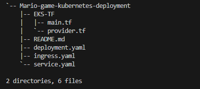


**COMMANDS TO DEPLOY YOUR CLUSTER**

***NOTE***: First switch your directory location to EKS-TF, because this is where the terraform scripts to create your cluster is in.


```bash
cd EKS-TF
```
---

To deploy your EKS cluster, run the following commands below;
```bash
terraform init
```

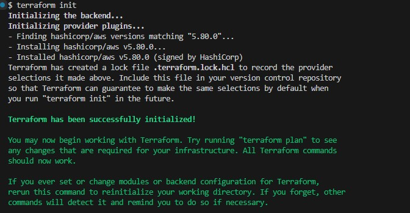


```bash
terraform plan
terraform apply –auto-approve
```
---


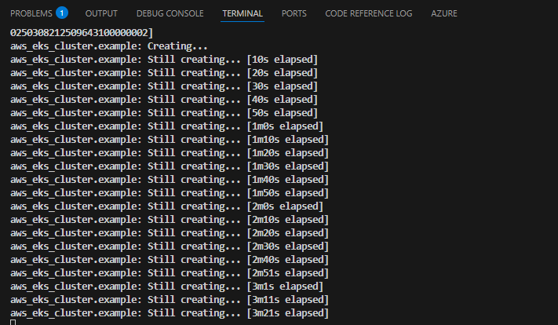
