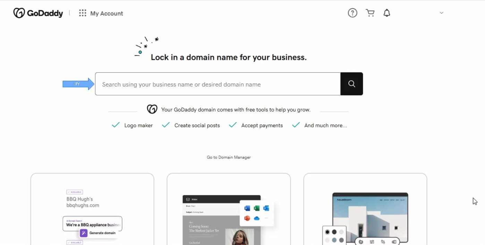

# Secured HTTPS Connection Using Kubernetes Ingress

This project demonstrates how to enhance the security of your application by creating a secured HTTPS connection using Kubernetes. By implementing the NGINX Ingress Controller and HTTPS protocol, this project provides a robust and scalable architecture for managing traffic efficiently and securely.

## Prerequisites

- AWS Account
- Terraform installed
- `kubectl` and `eksctl` configured
- Helm installed
- Domain name registered (e.g., via GoDaddy)

## Overview of Phases
This guide covers the following seven phases for setting up a secured HTTPS connection:

1. **Purchasing a Domain Name**
2. **Configuring Nameservers with AWS Route53 and GoDaddy**
3. **Creating the EKS Cluster**
4. **AWS Certificate Manager Setup**
5. **Deploying the NGINX Ingress Controller**
6. **AWS Load Balancer Configuration**
7. **Deploying the Ingress YAML File**

For detailed instructions, clone the repository:

```bash
git clone https://github.com/kingsleyzikora/ingress-project.git
```

---

## Detailed Guide
### Phase 1: Purchasing a Domain Name
Purchase your domain name from platforms like GoDaddy, click here [text](https://www.godaddy.com/en-ph). 
Follow the provided step-by-step instructions in the document for setup and configuration.


Click **Sign in** if you have an account or Create an Account . fill in your details to create an account.
Once fully setup, you should see a screen exactly like what we have below




### Phase 2: Configuring Nameservers
Generate nameservers using AWS Route53 and update them in your GoDaddy account. Detailed screenshots are provided in the document.

### Phase 3: Creating the EKS Cluster
Use the Terraform scripts to deploy your cluster. The repository includes the following file structure:
