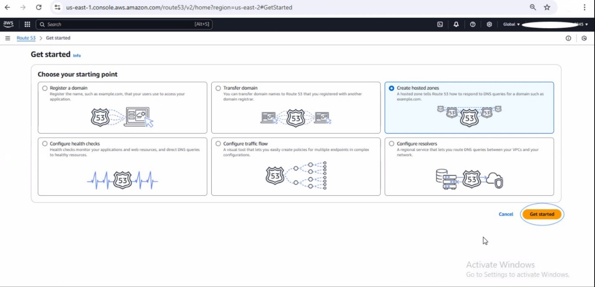

# Secured HTTPS Connection Using Kubernetes Ingress

This project demonstrates how to enhance the security of your application by creating a secured HTTPS connection using Kubernetes. By implementing the NGINX Ingress Controller and HTTPS protocol, this project provides a robust and scalable architecture for managing traffic efficiently and securely.

## Prerequisites

- AWS Account
- Terraform installed
- `kubectl` and `eksctl` configured
- Helm installed
- Domain name registered (e.g., via GoDaddy)

## Overview of Phases
This guide covers the following seven phases for setting up a secured HTTPS connection:

1. **Purchasing a Domain Name**
2. **Configuring Nameservers with AWS Route53 and GoDaddy**
3. **Creating the EKS Cluster**
4. **AWS Certificate Manager Setup**
5. **Deploying the NGINX Ingress Controller**
6. **AWS Load Balancer Configuration**
7. **Deploying the Ingress YAML File**

For detailed instructions, clone the repository:

```bash
git clone https://github.com/kingsleyzikora/ingress-project.git
```

---

## Detailed Guide
### Phase 1: Purchasing a Domain Name
Purchase your domain name from platforms like GoDaddy, click here [text](https://www.godaddy.com/en-ph). 
Follow the provided step-by-step instructions in the document for setup and configuration.


Click **Sign in** if you have an account or Create an Account . fill in your details to create an account.        

Once fully setup, you should see a screen exactly like what we have below


Follow the arrow and search for the domain name of your choice and purchase it.

For example my domain name for this project is ***ats-victorycenter.com*** , once selected, click on **make it yours** below to own it. 


•	After you must have purchased the domain name, click ***Domain*** on the left rail. 


•	Then click ***DNS***


•	Click ***Nameserver***


•	Click Change ***Nameservers***


•	At this stage, your setup will not yet include Nameservers. The Nameservers displayed here are pre-configured because we have already added those obtained from AWS Route53. 

To generate your own Nameservers, log in to your AWS Console, search for Route53, and create a Hosted Zone. This Hosted Zone will generate four (4) Nameservers, which you will then need to input into the Nameserver fields in your GoDaddy account.

•	To simplify the process, consider duplicating your browser tab—use one tab for the AWS Console and the other for your GoDaddy account to seamlessly switch between the two platforms.

•	Click on get started as shown in the screenshot below.




• Input your domain name in the box, but leave all settings as default. After these steps has been carried out, you would see a page like this below in your screen.

• Checkbox  the domain name row that has NS in the table as shown below. Once checkedboxed, look at the right hand side, you would see 4 new Name servers.


### Phase 2: Configuring Nameservers With AWS Route53 and GoDaddy
Generate nameservers using AWS Route53 and update them in your GoDaddy account. Detailed screenshots are provided in the document.

•	Navigate to AWS console, search for Route53, example screenshot below.


•	Click get started in yellow.


•	Click on create hosted zone .


### Phase 3: Creating the EKS Cluster
Use the Terraform scripts to deploy your cluster. The repository includes the following file structure:
